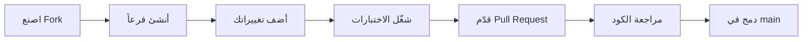

# 🤝 دليل المساهمة – WiFi Card Master Pro

شكراً جزيلاً لاهتمامك بالمساهمة في هذا المشروع! 🎉  
هذا الدليل يوضح كيفية المساهمة بطريقة منظّمة وفعّالة.

---

## 📜 قواعد السلوك

يرجى التعامل مع الجميع باحترام ولطف.  
نحن نتبع [Contributor Covenant](https://www.contributor-covenant.org/).

---

## 🚀 كيف تساهم؟

### 1️⃣ 🐛 الإبلاغ عن خطأ

إذا وجدت خطأ، افتح **Issue** جديد يحتوي على:

| المعلومة | الوصف |
|:---|:---|
| 📱 **الجهاز** | نوع الهاتف وإصدار Android |
| 📦 **إصدار التطبيق** | رقم الإصدار (مثلاً 1.0.0) |
| 📝 **وصف المشكلة** | شرح واضح لما حدث |
| 🔁 **خطوات إعادة الإنتاج** | كيف يمكننا تكرار المشكلة |
| 📸 **لقطة شاشة** | (اختياري) صورة توضيحية |

---

### 2️⃣ 💡 اقتراح ميزة جديدة

- افتح **Issue** بعنوان `[اقتراح] وصف الميزة`.
- صف الميزة بالتفصيل: كيف تعمل؟ لماذا مفيدة؟
- ناقش الفكرة مع المشرفين قبل البدء في تنفيذها.

---

### 3️⃣ 🔧 المساهمة بالكود (Pull Request)

#### 🛠️ إعداد بيئة التطوير

```bash
# 1. قم بعمل Fork للمستودع من GitHub

# 2. استنساخ المستودع إلى جهازك
git clone https://github.com/your-username/WiFiCardMasterPro.git
cd WiFiCardMasterPro

# 3. أضف المستودع الأصلي كـ upstream
git remote add upstream https://github.com/original-username/WiFiCardMasterPro.git

# 4. افتح المشروع في Android Studio
# تأكد من تثبيت JDK 17 و Gradle 8.2
```

📝 إنشاء فرع جديد

```bash
git checkout -b feature/اسم-الميزة
# أو
git checkout -b fix/وصف-الإصلاح
```

البادئة الاستخدام
feature/ لميزة جديدة
fix/ لإصلاح خطأ
docs/ لتغييرات التوثيق
refactor/ لتحسين الكود

---

🎯 معايير الكود

Kotlin

· اتبع دليل أسلوب Kotlin الرسمي.
· استخدم اللغة الإنجليزية في أسماء المتغيرات، الدوال، والحزم.
· استخدم camelCase للمتغيرات والدوال، و PascalCase للفئات.

التعليقات

· التعليقات العامة بالعربية أو الإنجليزية.
· تعليقات الكود (KDoc) بالإنجليزية.
· وثق الدوال العامة والفئات الرئيسية.

المعمارية

· اتبع نمط MVVM + Repository.
· لا تضع كود Android في طبقة Domain.
· استخدم Use Cases لكل عملية تجارية.
· استخدم Coroutines + Flow للعمليات غير المتزامنة.

التنسيق التلقائي

```bash
# إعادة تنسيق الكود في Android Studio
Ctrl + Alt + L (Windows/Linux)
Cmd + Option + L (Mac)
```

---

✅ قبل تقديم Pull Request

· تأكد من نجاح بناء المشروع: ./gradlew assembleDebug
· مرر جميع الاختبارات: ./gradlew test
· أضف اختبارات جديدة إذا لزم الأمر.
· تأكد من عدم وجود تحذيرات Lint.
· اكتب رسالة Commit واضحة (انظر الأسفل).
· تأكد من أن الفرع محدّث مع main.

📝 رسائل Commit

نستخدم تنسيق Conventional Commits:

```
<type>(<scope>): <description>

[body]
```

النوع الوصف
feat ميزة جديدة
fix إصلاح خطأ
docs تغيير في التوثيق
refactor إعادة هيكلة كود
test إضافة اختبار
chore مهام روتينية

مثال:

```
feat(home): add card generation with custom charset

- Added charset chip group selection
- Implemented GenerateCardsUseCase
- Connected UI with HomeViewModel
```

---

🔄 سير العمل (Workflow)



---

🧪 اختبار الكود

تشغيل اختبارات الوحدة

```bash
./gradlew test
```

تشغيل اختبارات الواجهة (على محاكي أو جهاز)

```bash
./gradlew connectedAndroidTest
```

إضافة اختبار جديد

```kotlin
// مثال: tests/kotlin/.../NewFeatureTest.kt
class NewFeatureTest {
    @Test
    fun `should return correct result`() {
        val result = someClass.doWork()
        assertEquals(expected, result)
    }
}
```

---

🗂️ هيكل المشروع السريع

المجلد المحتوى
data/local/database/ Room DAOs و Entities
data/local/preferences/ DataStore التفضيلات
data/repository/ تنفيذ واجهات الـ Repository
domain/model/ نماذج الأعمال النقية
domain/usecase/ حالات الاستخدام (Use Cases)
presentation/common/ فئات أساسية قابلة لإعادة الاستخدام
presentation/home/ صفحة التوليد (MVVM)
presentation/test/ صفحة الاختبار (WebView)
presentation/settings/ الإعدادات وإدارة الراوترات
presentation/history/ سجل النتائج والجلسات

---

📄 الترخيص

بالمساهمة، فإنك توافق على ترخيص مساهماتك تحت MIT License.

---

🙏 شكراً

كل مساهمة، صغيرة كانت أم كبيرة، تُحدث فرقاً.
شكراً لوقتك وجهدك! ❤️
